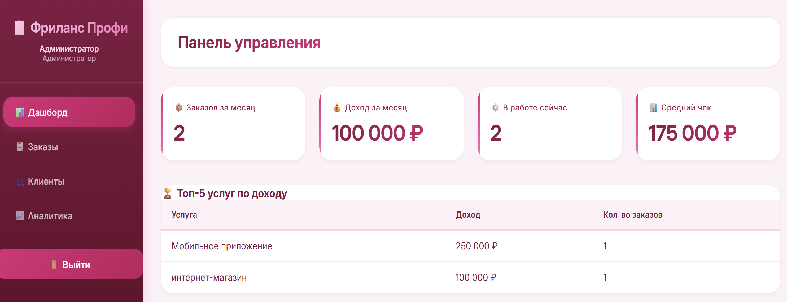
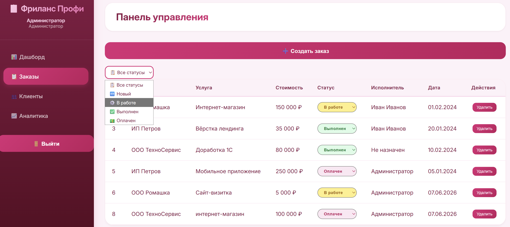
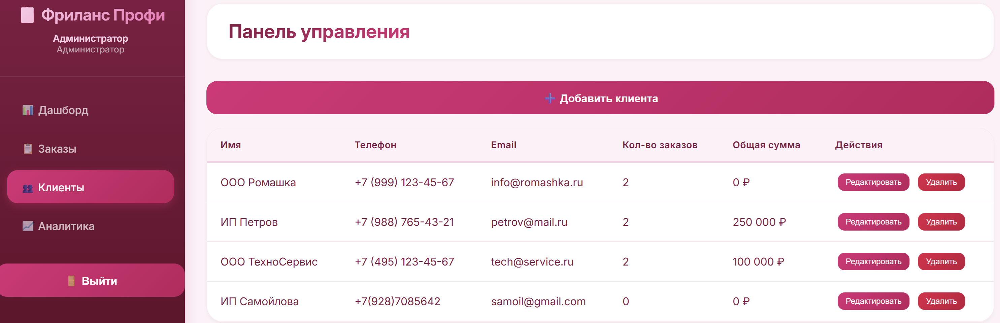

# 📋 Личный кабинет фрилансера

Full-stack веб-приложение для управления заказами, клиентами и финансами фрилансера или небольшой студии. Система с разграничением ролей администратора и исполнителя.

## 📸 Скриншоты

| Дашборд | Заказы | Клиенты |
|---------|--------|---------|
|  |  |  |

## 🚀 Технологии

| Технология | Назначение |
|------------|------------|
| C# / .NET 8 | Бэкенд |
| ASP.NET Core Web API | REST API |
| Entity Framework Core | ORM |
| SQLite | База данных |
| JWT | Аутентификация |
| BCrypt | Хеширование паролей |
| HTML5/CSS3/JS | Фронтенд |

## 📦 Установка и запуск

```bash
# 1. Клонировать репозиторий
git clone https://github.com/Riliana-say/freelancer-personal-account.git

# 2. Перейти в папку проекта
cd freelancer-personal-account

# 3. Восстановить зависимости
dotnet restore

# 4. Запустить проект
dotnet run